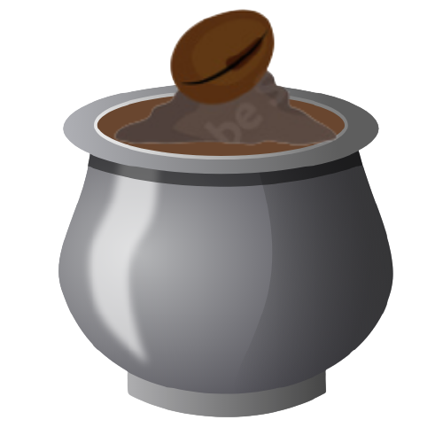
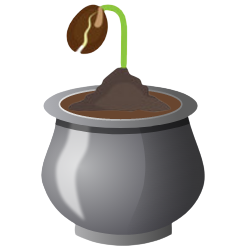
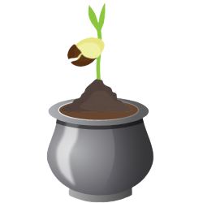
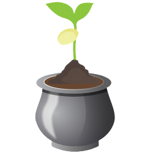
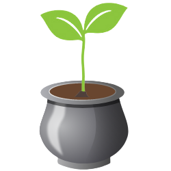
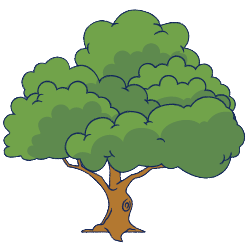
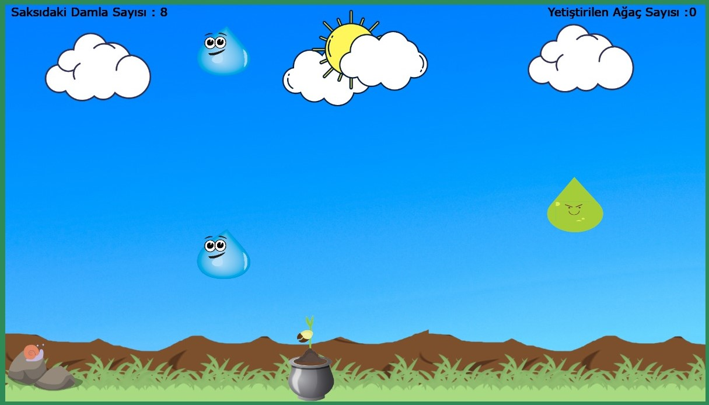
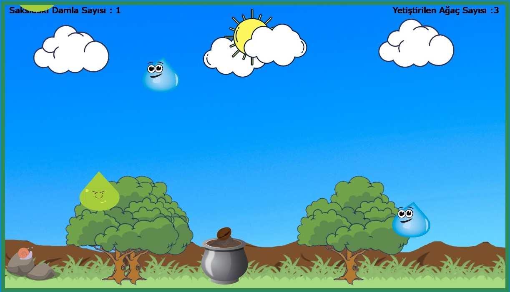
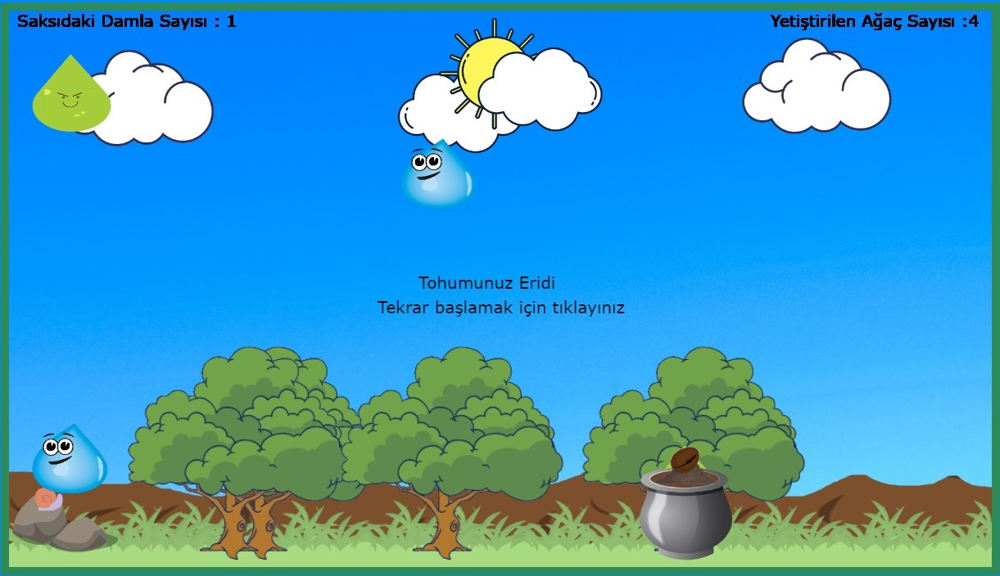

# 🤔 Kullanıcı Deneyimleri 💭

<b>Kullanıcı Deneyimleri, insanların siteye girip kendi hesapları ile belirli bir ürün hakkındaki deneyimlerini paylaşabildikleri bir web sitesidir.</b>

Oyununa buradan ulaşabilirsiniz. 👉 [Oyun Linki](https://ahmetmert1.github.io/Catch-the-Drop/) 👈

## Oyunun Amacı
Ağaçsız bir çevreyi elimizdeki saksının içindeki tohumu <b>su</b> damlalarıyla yeşertip, onu fidan olarak doğaya kazandırmaya çalışıyoruz.
Her fidan büyüdüğünde arkada bir ağaç olarak yerini alıyor ve orman yeşillenmeye başlıyor.
Ancak bunu yaparken <b>asit</b> damlalarından kaçmamız gerekiyor. Tohumumuz her bir asit aldığında bir önceki evresine dönüyor.
Eğer bitkimiz daha tohum evresindeyken asit ile karşılaşırsa oyunu kaybediyoruz.

     

## Nasıl Oynanır?
Klavyedeki `⬅️` ve `➡️` tuşlarını kullanarak saksıyı hareket ettir ve asitlerden kaçarken damlaları yakalamaya çalış.
`Mouse Left Click` ile kaybettiğin zaman oyuna tekrar başlayabilirsin.

# Oyun içi Görüntüler
Ağaç eklenmemiş oyunun ilk hali &emsp;&emsp;&emsp;&emsp;&emsp;&emsp;&emsp;&emsp;&emsp;&emsp;&emsp;&emsp;&emsp;&emsp;&emsp;&emsp;     Ağaç eklenmiş hali

   

Kayıp Ekranı

 
# 💻 Teknolojiler 
- HTML 
- JavaScript 
- CSS

# 🎨 Tasarım 
Oyunda yer alan resimlerin kimini birkaç resimin oluşmasından kendim tasarladım kimini direkt olarak png olarak koydum.

Tasarımlarım: Arka plan resmi, bitki evreleri ve asit damlası.

Tasarım platformu olarak [canva.com](https://www.canva.com/) 'u tercih ettim.

# 🔊 Ses Efektleri ve Müzik 
Oyundaki yer alan sesler [mixkit.co](https://mixkit.co/) sitesinden ve youtubeden alınmıştır.

# 📞 Lisans ve İletişim
Oyun hikayesi tasarımı, nesne tasarımları ve kodlar  [@ahmetmert1](https://github.com/ahmetmert1) tarafından yapılmıştır. 

[Linkedin](https://www.linkedin.com/in/ahmet-mert-öz)

[E-posta](ahmetmertoz11@gmail.com)
